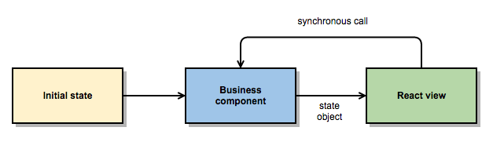

# React+Bacon.js TodoMVC

Demonstration about the power and simplicity of React/FRP combo.

## Motivation

Flux does a nice job when abstracting views from the "business logic".
However Flux application tend to be complex and have a slight enterprise
smell with all those actions dispatchers, stores and listeners. This
introduces a lot of boilerplate and unnecessary complexity to the 
codebase. 

This TodoMVC project demonstrates how to bypass all those intermediate 
steps and keep your views clean with the power of FRP.

## How it works?

The most fundamental concept of [Functional Reactive Programming (FRP)](http://en.wikipedia.org/wiki/Functional_reactive_programming)
is the **event stream**. Streams are like arrays of events: they can be mapped, 
filtered, merged and combined. 

The **main idea** is that every user action is just an event stream that is merged 
to the "application state" stream. Occurred events cause the application state to 
change. Finally the changed state object is then rendered **at the top level** of
the application: React's virtual DOM does the rest!

This enables **extremely simple** React views. No callbacks and/or listener 
registrations are needed: the views only render what they are given and
call synchronously the business logic interface on user actions. Business logic
streams then propagate the state change back to views (which is again rendered
stupidly). Nothing more is needed!



The essential component is the `Dispatcher` which is basically just an object
of Bacon buses (`Bacon.Bus` is a stream that can have data pushed into it. Equals Rx's `Subject`).

```javascript
const Bacon = require('baconjs')

module.exports = function() {
  const busCache = {}

  this.stream = function(name) {
    return bus(name)
  }
  this.push = function(name, value) {
    bus(name).push(value)
  }
  this.plug = function(name, value) {
    bus(name).plug(value)
  }

  function bus(name) {
    return busCache[name] = busCache[name] || new Bacon.Bus()
  }
}
```

This dispatcher enables the easy emitting and listening of user actions:

```javascript
const Bacon       = require('baconjs'),
      Dispatcher  = require('./dispatcher')

const d = new Dispatcher()

module.exports = {
  toItemsProperty: function(initialItems, filterS) {
    const itemsS = Bacon.update(initialItems,
      [d.stream('remove')],           removeItem,
      [d.stream('create')],           createItem,
      [d.stream('addState')],         addItemState,
      [d.stream('removeState')],      removeItemState,
      [d.stream('removeCompleted')],  removeCompleteItems,
      [d.stream('updateTitle')],      updateItemTitle
    )

    return Bacon.combineAsArray([itemsS, filterS])
      .map(withDisplayStatus)

    ... business logic here ...
  },

  // "public" methods

  createItem: function(title) {
    d.push('create', title)
  },

  removeItem: function(itemId) {
    d.push('remove', itemId)
  },

  removeCompleted: function() {
    d.push('removeCompleted')
  },

  setTitle: function(itemId, title) {
    d.push('updateTitle', {itemId, title})
  },
  
  ...
}
```

Business logic can be added to state stream easily with `Bacon.combineTemplate`:

```javascript
const React   = require('react'),
      Bacon   = require('baconjs'),
      TodoApp = require('./todoApp'),
      todos   = require('./todos'),
      filter  = require('./filter')

const filterP = filter.toProperty(...intial filter state...),
      itemsP  = todos.toItemsProperty([], filterP)

const appState = Bacon.combineTemplate({
  items: itemsP,
  filter: filterP
})

appState.onValue((state) => {
  React.render(<TodoApp {...state} />, document.getElementById('todoapp'))
})
```

After that, using your business logic is dead simple:

```jsx
const todos = require('./todos')
...
<button onClick={() => todos.removeCompleted()}>Clear completed</button>
```

And note that view does not need to know if action is synchronous or
asynchronous: it's up to business logic to decide that.


## Playing with the project

Feel free to clone the repository and start playing with the project:

```bash 
git clone git@github.com:milankinen/react-bacon-todomvc.git
npm install
npm run watch
open "$(pwd)/index.html"
```

## License

MIT

